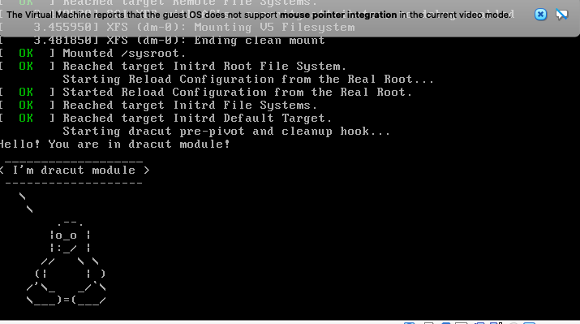

# ДЗ 6

## Подготовка

Для задания я собрал образ `yan4ik/centos-7-oldkernel`. Образ взят из первого дз (только без обновленного ядра). На дефолтном `centos/7` у меня не заработал ни один способ ¯\_(ツ)_/¯.

Запускаем образ и смотрим на диски:
```ShellSession
> vagrant up
...
> vagrant ssh
...
[vagrant@lvm ~]$ sudo -i
[root@dz5 ~]# lsblk
NAME            MAJ:MIN RM SIZE RO TYPE MOUNTPOINT
sda               8:0    0  10G  0 disk
|-sda1            8:1    0   1G  0 part /boot
`-sda2            8:2    0   9G  0 part
  |-centos-root 253:0    0   8G  0 lvm  /
  `-centos-swap 253:1    0   1G  0 lvm  [SWAP]
[root@dz5 ~]# lvs
  LV   VG     Attr       LSize  Pool Origin Data%  Meta%  Move Log Cpy%Sync Convert
  root centos -wi-ao---- <8.00g                                                    
  swap centos -wi-ao----  1.00g
[root@dz5 ~]# vgs
  VG     #PV #LV #SN Attr   VSize  VFree
  centos   1   2   0 wz--n- <9.00g    0
```

## Задания

### Часть 1: вход в систему без пароля

Останавливаем виртуалку: `vagrant halt`.

Включаем ее теперь через интерфейс VirtualBox и заходим в загрузчик.

**Способ 1:** прописываем `rd.break`

```ShellSession
switch_root:/# mount | fgrep root
rootfs on / type rootfs (rw)
/dev/mapper/centos-root on /sysroot type xfs (ro,relatime,attr2,inode64,noquota)
switch_root:/# mount -o remount,rw /sysroot
switch_root:/# mount | fgrep root
rootfs on / type rootfs (rw)
/dev/mapper/centos-root on /sysroot type xfs (rw,relatime,attr2,inode64,noquota)
switch_root:/# chroot /sysroot
sh-4.2# passwd root
...
sh-4.2# touch /.autorelabel
sh-4.2# exit
switch_root:/# reboot
```

**Способ 2:** прописываем `rw init=/sysroot/bin/sh`

```ShellSession
:/# mount | fgrep root
rootfs on / type rootfs (rw)
/dev/mapper/centos-root on /sysroot type xfs (rw,relatime,attr2,inode64,noquota)
```

### Часть 2 и 3: переименовываем VG и добавляем модуль.

Сделаем сразу обе части.

```ShellSession
[root@dz5 ~]# vgs
  VG     #PV #LV #SN Attr   VSize  VFree
  centos   1   2   0 wz--n- <9.00g    0
[root@dz5 ~]# vgrename centos otus_root
  Volume group "centos" successfully renamed to "otus_root"
```

Правим `/etc/fstab`, `/etc/default/grub`, `/boot/grub2/grub.cfg`.

Теперь по описанным шагам добавляем модуль в initrd.

Теперь пересобираем образ initrd:
```ShellSession
[root@dz5 ~] mkinitrd -f -v /boot/initramfs-$(uname -r).img $(uname -r)
...
*** Creating image file done ***
*** Creating initramfs image file '/boot/initramfs-3.10.0-1127.18.2.el7.x86_64.img' done ***
[root@dz5 ~]# lsinitrd -m /boot/initramfs-$(uname -r).img | grep test
test
```

Дальше ребутаемся и во-первых видим пингвинчика (скрин ниже) и успешно переименованные VG:
```ShellSession
[root@dz5 ~]# vgs
  VG        #PV #LV #SN Attr   VSize  VFree
  otus_root   1   2   0 wz--n- <9.00g    0
```


